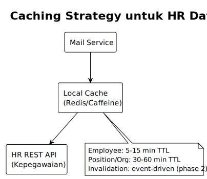

# 2. DECOMPOSITION STRATEGY (Strategi Dekomposisi)

[← Kembali ke README](./README.md) | [← Domain Analysis](./01-domain-analysis.md)

---

## 2.1 Prinsip Pemisahan

### Boundary Rule (Aturan Batas)
> **Mail Service TIDAK BOLEH memiliki atau mengakses langsung** tabel-tabel: `employee`, `emp_profile`, `position`, `organization`, `sys_user`, `sys_role`, `location`.

**Why?**
- Tabel-tabel tersebut adalah domain HR Service (Kepegawaian)
- Akses langsung = tight coupling = tidak bisa di-deploy/scale independen
- Perubahan schema HR akan breakchain Mail Service

### Ownership Rule (Aturan Kepemilikan)
Tabel yang **dimiliki Mail Service**:
```
mail, mail_recipient, mail_folder, mail_archive, mail_archive_access,
mail_archive_notif, mail_archive_notif_log, mail_category, mail_type,
mail_category_statistic, mail_org_statistic, mail_respontime,
attachments (ref_type=1,2), attachment_download_history,
smtp_mail_config, smtp_mail_log
```

Tabel yang harus di-akses via **HR REST API**:
```
employee, emp_profile, position, organization, location, sys_user
```

Tabel yang harus di-akses via **AppWrite API**:
```
Authentication, session management (menggantikan ci_sessions, ci_eoffice_sessions)
```

## 2.2 Data Consistency Strategy

### A. Denormalisasi Terkontrol (Controlled Denormalization)

Legacy system sudah melakukan denormalisasi pada beberapa tempat, dan **ini adalah keputusan yang benar** untuk microservice:

```
mail_recipient.emp_name    → Snapshot nama saat surat dibuat
mail_recipient.pos_name    → Snapshot jabatan saat surat dibuat
mail.m_created_by_name     → Snapshot nama pengirim
mail_archive.ma_archive_by_name → Snapshot nama pengarsip
```

**Why?**
- Surat adalah dokumen resmi. Nama dan jabatan pada saat surat dibuat tidak boleh berubah retroaktif
- Menghindari dependency ke HR API saat baca surat (read-heavy operation)
- Jika pegawai mutasi/resign, histori surat tetap benar

### B. ID Reference Pattern

Mail Service menyimpan **hanya ID** untuk referensi ke entitas HR:
```
mail.m_created_by          → user_id (referensi ke sys_user via AppWrite)
mail_recipient.user_id     → user_id
mail_recipient.emp_id      → employee_id (referensi ke HR API)
mail_recipient.pos_id      → position_id (referensi ke HR API)
mail_archive_access.pos_id → position_id
mail_archive.ma_org_id     → organization_id
```

**Flow saat butuh data terkini:**
```
Mail Service → HR REST API (by emp_id/pos_id) → Response DTO
```

### C. Caching Strategy untuk HR Data



- **Employee data:** Cache 5-15 menit (jarang berubah)
- **Position/Org data:** Cache 30-60 menit (sangat jarang berubah)
- **Cache invalidation:** Event-driven via message broker (opsional fase 2)

**Why cache?**
- Halaman inbox JOIN ke employee/position di setiap query (read-heavy)
- HR API tidak perlu menerima ribuan request redundan
- Fallback ke denormalized data jika HR API down

## 2.3 Tabel `sys_user_task` — Keputusan Kritis

Tabel `sys_user_task` adalah **pivot table** yang mengatur routing surat ke folder user:

```sql
sys_user_task: user_task_id, user_id, tm_id(mail_id), folder_id,
               read_status, restore_folder_id, mail_created_date
```

**Keputusan:** Tabel ini **dimiliki oleh Mail Service**, bukan auth/user service.

**Why?**
- Fungsinya murni mail-routing (folder assignment, read status)
- Tightly coupled dengan mail lifecycle (send → create inbox task)
- User ID cukup disimpan sebagai foreign reference

---

[Selanjutnya: Architectural Design →](./03-architectural-design.md)
