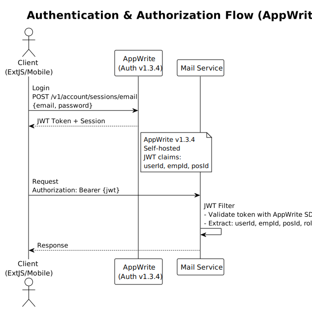

# 3. ARCHITECTURAL DESIGN (Desain Arsitektur)

[← Kembali ke README](./README.md) | [← Decomposition Strategy](./02-decomposition-strategy.md)

---

## 3.1 Layered Architecture (Spring Boot)


## 3.2 Package Structure

```
id.perumdamts.mail/
├── config/                     # Spring configuration
│   ├── SecurityConfig          # AppWrite JWT validation
│   ├── WebClientConfig         # HR API WebClient bean
│   └── CacheConfig             # Caffeine/Redis cache
├── controller/                 # REST Controllers
│   ├── MailController
│   ├── MailFolderController
│   ├── MailArchiveController
│   ├── MailCategoryController
│   ├── MailTypeController
│   └── AttachmentController
├── service/                    # Business Logic
│   ├── MailService
│   ├── MailSendService         # Send + notification orchestration
│   ├── MailArchiveService
│   ├── MailNumberGeneratorService
│   ├── MailStatisticService
│   └── NotificationService     # SMTP + Firebase
├── integration/                # External service clients
│   ├── hr/
│   │   ├── HrServiceClient
│   │   └── dto/                # DTO dari HR API
│   ├── appwrite/
│   │   └── AppWriteAuthClient
│   └── notification/
│       ├── SmtpMailService
│       └── FirebasePushService
├── repository/                 # Spring Data JPA
│   ├── MailRepository
│   ├── MailRecipientRepository
│   ├── MailFolderRepository
│   ├── MailArchiveRepository
│   ├── MailArchiveAccessRepository
│   ├── MailCategoryRepository
│   ├── MailTypeRepository
│   ├── AttachmentRepository
│   ├── UserTaskRepository
│   └── SmtpMailLogRepository
├── domain/                     # JPA Entities
│   ├── Mail
│   ├── MailRecipient
│   ├── MailFolder
│   ├── MailArchive
│   ├── MailArchiveAccess
│   ├── MailCategory
│   ├── MailType
│   ├── Attachment
│   ├── UserTask
│   └── enums/
│       ├── MailStatus
│       ├── FolderType
│       └── CirculationType
├── dto/                        # Request/Response DTOs
│   ├── request/
│   │   ├── MailCreateRequest
│   │   ├── MailSendRequest
│   │   ├── RecipientRequest
│   │   ├── ArchiveCreateRequest
│   │   └── FolderRequest
│   └── response/
│       ├── MailResponse
│       ├── MailDetailResponse
│       ├── MailFolderResponse
│       ├── ArchiveResponse
│       └── PagedResponse<T>
└── exception/                  # Custom exceptions
    ├── MailNotFoundException
    ├── DuplicateNumberException
    └── UnauthorizedArchiveAccessException
```

## 3.3 RESTful Endpoint Design

### Mail Operations

| Method | Endpoint | Deskripsi | Legacy Equivalent |
|--------|----------|-----------|-------------------|
| `GET` | `/api/v1/mails/folders` | Daftar folder user | `Mail.getFolder()` |
| `POST` | `/api/v1/mails/folders` | Buat folder baru | `Mail.saveFolder()` |
| `PUT` | `/api/v1/mails/folders/{folderId}` | Update folder | `Mail.saveFolder()` |
| `DELETE` | `/api/v1/mails/folders/{folderId}` | Hapus folder | `Mail.delFolder()` |
| `GET` | `/api/v1/mails/folders/{folderId}/mails` | Baca surat per folder | `Mail.readFolder()` |
| `GET` | `/api/v1/mails/{mailId}` | Detail surat | Direct DB read |
| `POST` | `/api/v1/mails` | Buat draft surat | `Mail.save()` |
| `PUT` | `/api/v1/mails/{mailId}` | Update draft | `Mail.save()` |
| `POST` | `/api/v1/mails/{mailId}/send` | Kirim surat | `MailModel.send()` |
| `DELETE` | `/api/v1/mails/{mailId}` | Hapus/pindah ke trash | `Mail.delMail()` |
| `POST` | `/api/v1/mails/{mailId}/restore` | Restore dari trash | `Mail.restore()` |
| `POST` | `/api/v1/mails/{mailId}/move` | Pindah ke folder | `Mail.move()` |
| `PUT` | `/api/v1/mails/{mailId}/read` | Tandai sudah dibaca | `Mail.setRead()` |
| `GET` | `/api/v1/mails/{mailId}/track` | Tracking surat | `Mail.trackMail()` |
| `GET` | `/api/v1/mails/search` | Cari surat | `Mail.find()` |
| `GET` | `/api/v1/mails/counter` | Hitung unread per folder | `Mail.getcounter()` |
| `DELETE` | `/api/v1/mails/trash` | Kosongkan trash | `Mail.empty_trash()` |

### Recipient Operations

| Method | Endpoint | Deskripsi |
|--------|----------|-----------|
| `GET` | `/api/v1/mails/{mailId}/recipients` | Daftar penerima |
| `POST` | `/api/v1/mails/{mailId}/recipients` | Tambah penerima |
| `POST` | `/api/v1/mails/{mailId}/recipients/batch` | Tambah multi penerima |
| `PUT` | `/api/v1/mails/{mailId}/recipients/{recipientId}` | Update penerima |
| `DELETE` | `/api/v1/mails/{mailId}/recipients/{recipientId}` | Hapus penerima |
| `POST` | `/api/v1/mails/{mailId}/recipients/copy/{refMailId}` | Copy dari surat lain |

### Attachment Operations

| Method | Endpoint | Deskripsi |
|--------|----------|-----------|
| `GET` | `/api/v1/attachments?refType={type}&refId={id}` | Daftar lampiran |
| `POST` | `/api/v1/attachments` | Upload lampiran |
| `GET` | `/api/v1/attachments/{attachmentId}` | Detail lampiran |
| `GET` | `/api/v1/attachments/{attachmentId}/download` | Download file |
| `DELETE` | `/api/v1/attachments/{attachmentId}` | Hapus lampiran |
| `GET` | `/api/v1/attachments/{attachmentId}/history` | Histori download |

### Archive Operations

| Method | Endpoint | Deskripsi |
|--------|----------|-----------|
| `GET` | `/api/v1/archives` | Daftar arsip |
| `GET` | `/api/v1/archives/search` | Cari arsip (dengan access control) |
| `POST` | `/api/v1/archives` | Buat arsip baru |
| `PUT` | `/api/v1/archives/{archiveId}` | Update arsip |
| `PUT` | `/api/v1/archives/{archiveId}/publish` | Publish arsip (status → 2) |
| `DELETE` | `/api/v1/archives/{archiveId}` | Hapus arsip |
| `GET` | `/api/v1/archives/{archiveId}/access` | Daftar hak akses |
| `PUT` | `/api/v1/archives/{archiveId}/access` | Set hak akses |
| `POST` | `/api/v1/mails/{mailId}/archive` | Direct arsip dari surat |

### Master Data Operations

| Method | Endpoint | Deskripsi |
|--------|----------|-----------|
| `GET` | `/api/v1/mail-types` | Daftar jenis surat |
| `POST` | `/api/v1/mail-types` | Tambah jenis surat |
| `PUT` | `/api/v1/mail-types/{typeId}` | Update jenis surat |
| `DELETE` | `/api/v1/mail-types/{typeId}` | Hapus jenis surat |
| `GET` | `/api/v1/mail-categories` | Daftar kategori |
| `POST` | `/api/v1/mail-categories` | Tambah kategori |
| `PUT` | `/api/v1/mail-categories/{categoryId}` | Update kategori |
| `DELETE` | `/api/v1/mail-categories/{categoryId}` | Hapus kategori |

### Statistics & Reports

| Method | Endpoint | Deskripsi |
|--------|----------|-----------|
| `GET` | `/api/v1/statistics/categories?period={yyyyMM}` | Statistik per kategori |
| `GET` | `/api/v1/statistics/organizations?period={yyyyMM}` | Statistik per organisasi |
| `GET` | `/api/v1/statistics/response-time` | Response time report |
| `GET` | `/api/v1/mails/{mailId}/read-status` | Status baca per penerima |

## 3.4 DTO Pattern Justification

### Why DTOs (bukan langsung expose Entity)?

1. **Security** — Entity `Mail` punya `m_content` (HTML) yang besar. List view tidak perlu content, hanya subject. DTO `MailSummaryResponse` vs `MailDetailResponse` mengontrol ini.

2. **Decoupling from Schema** — Kolom legacy `m_no_surat_masuk`, `m_asal_surat_masuk` di-rename di DTO menjadi `incomingMailNumber`, `incomingMailSource` tanpa mengubah database.

3. **Aggregation** — `MailDetailResponse` menggabungkan data dari `mail` + `mail_recipient` + `mail_category` + HR API (employee name/position). Entity tidak bisa melakukan ini.

4. **Versioning** — API v1 DTO bisa beda dengan v2 DTO tanpa mengubah entity/schema.

### Key DTO Mapping Examples

```
# Request: Create Mail
MailCreateRequest {
    date, typeId, categoryId, subject, content, note,
    maxResponseDate, rootId, parentId,
    incomingMailNumber, incomingMailSource, incomingMailDate,
    outgoingDestination, outgoingRecipientName,
    recipients: [{ empId, circulation }],
    send: boolean
}

# Response: Mail in Folder List (lightweight)
MailSummaryResponse {
    id, number, date, subject, senderName, senderEmpId,
    recipientsSummary, typeName, categoryName, categoryCode,
    readStatus, attachmentCount, circulationType, createdDate
}

# Response: Mail Detail (full)
MailDetailResponse {
    id, number, date, subject, content, note,
    senderName, senderPositionName,
    typeName, categoryName, categoryCode,
    maxResponseDate, attachmentCount,
    rootId, parentId,
    incomingMailNumber, incomingMailSource, incomingMailDate,
    outgoingDestination, outgoingRecipientName,
    recipients: [{ id, empName, posName, circulation, emailFlag, smsFlag }],
    attachments: [{ id, fileName, fileSize, fileExt, uploadDate, uploadBy }],
    archiveId (if archived)
}
```

## 3.5 Authentication & Authorization dengan AppWrite

### Flow



**Why AppWrite?**
- Sudah digunakan sebagai identity provider (self-hosted v1.3.4)
- Menggantikan `ci_sessions` dan `sys_user` untuk autentikasi
- JWT token berisi claim user_id, emp_id, pos_id yang diperlukan Mail Service
- Centralized auth = satu sumber kebenaran untuk identity

### Authorization Mapping

Legacy `sys_role_menu_event` → Spring Security `@PreAuthorize`:
- **ROLE_MAIL_READ** — Baca folder inbox/sent/draft
- **ROLE_MAIL_COMPOSE** — Buat dan kirim surat
- **ROLE_MAIL_ARCHIVE** — Akses menu arsip (legacy: `ID_MENU_ARSIP`)
- **ROLE_MAIL_ADMIN** — CRUD master data (type, category)

---

[Selanjutnya: UML Visualization →](./04-uml-visualization.md)
