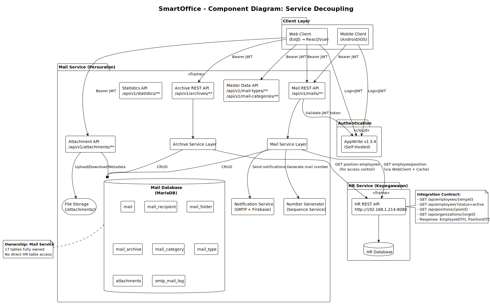
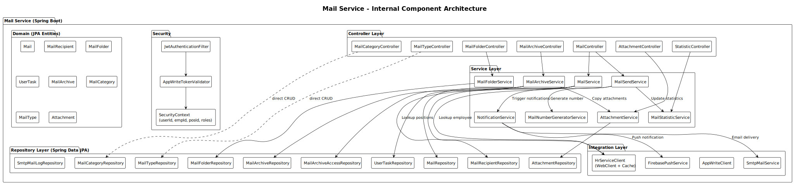
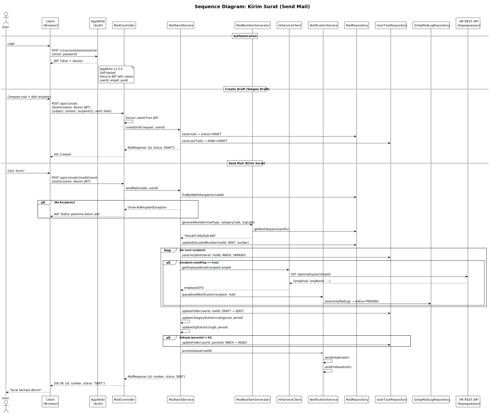
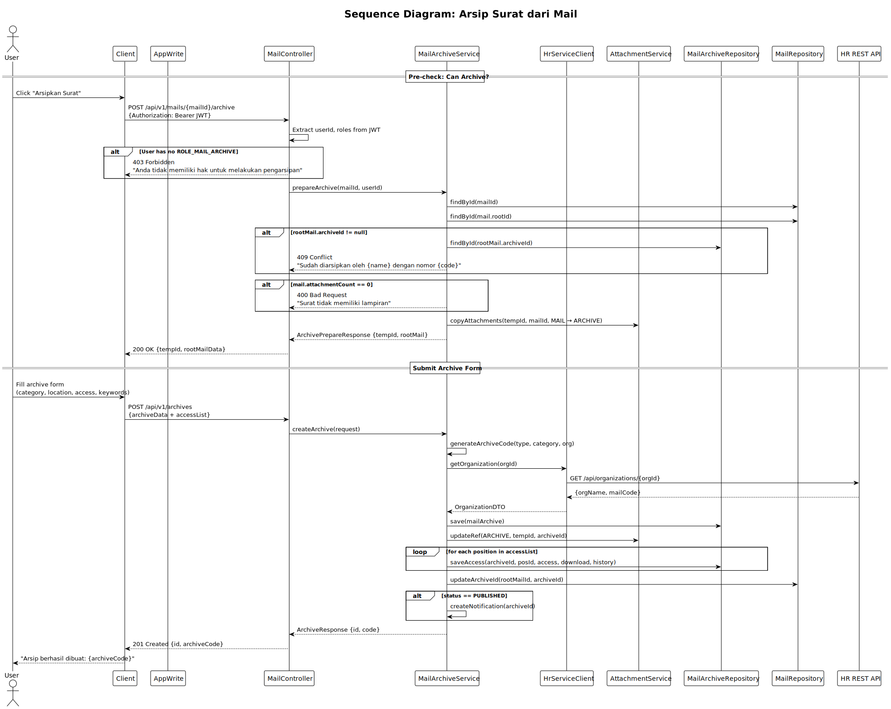
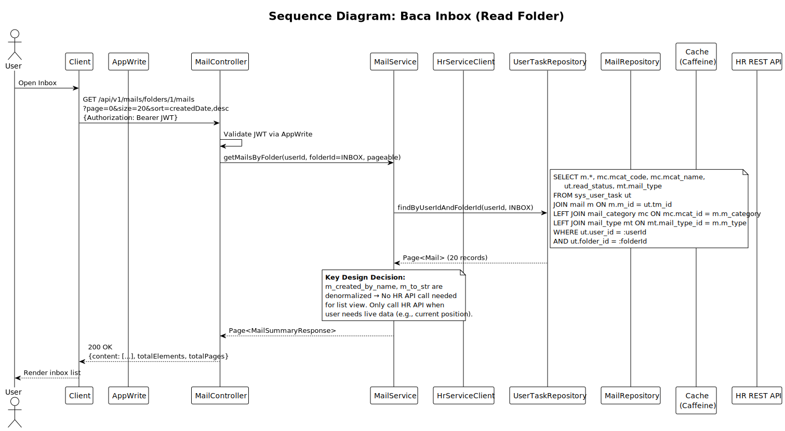
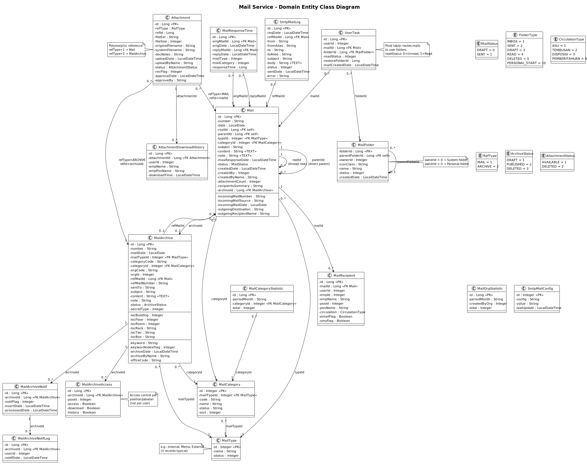

# 4. UML VISUALIZATION

[← Kembali ke README](./README.md) | [← Architectural Design](./03-architectural-design.md)

---

## 4.1 Component Diagram — Service Decoupling

> Source: [puml/component-diagram-overview.puml](./puml/component-diagram-overview.puml)

## 4.2 Component Diagram — Internal Mail Service Architecture

> Source: [puml/component-diagram-internal.puml](./puml/component-diagram-internal.puml)

## 4.3 Sequence Diagram — Send Mail (Kirim Surat)

> Source: [puml/sequence-send-mail.puml](./puml/sequence-send-mail.puml)

## 4.4 Sequence Diagram — Archive Mail (Arsip Surat)

> Source: [puml/sequence-archive-mail.puml](./puml/sequence-archive-mail.puml)

## 4.5 Sequence Diagram — Read Inbox with HR Integration

> Source: [puml/sequence-read-inbox.puml](./puml/sequence-read-inbox.puml)

## 4.6 Class Diagram — Domain Entities

> Source: [puml/class-diagram-domain.puml](./puml/class-diagram-domain.puml)

---

[Selanjutnya: Migration Risks →](./05-migration-risks.md)
