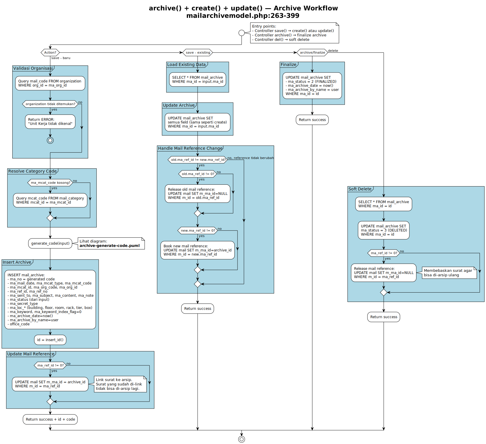
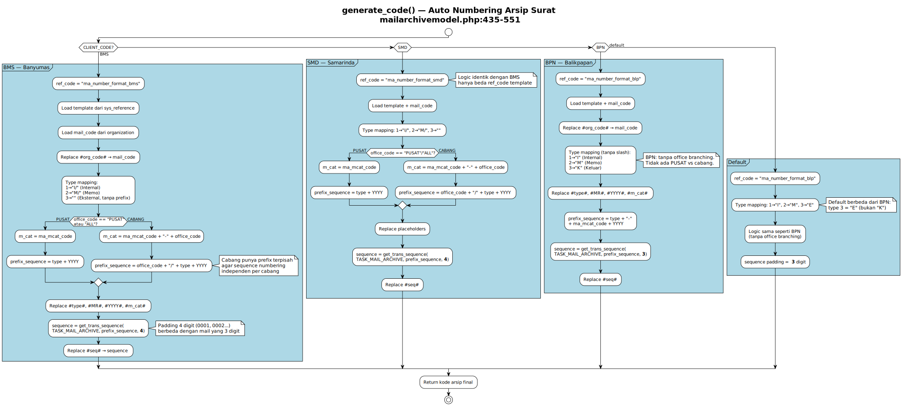
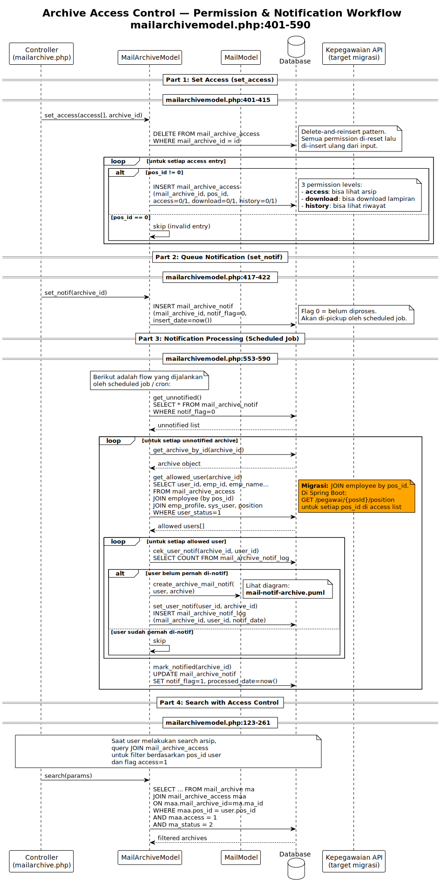

# Mail Archive - Business Logic Diagrams

> Modul arsip surat digital.
> Source: `server/application/direct/mailarchive.php` + `server/application/models/mailarchivemodel.php`

Dokumen ini dioptimalkan untuk preview GitHub menggunakan file SVG agar diagram yang panjang tetap terbaca.

## Diagram Index

| Diagram | Source Code | Type | Complexity | Preview | PlantUML |
|---|---|---|---|---|---|
| `archive() + create() + update()` | `mailarchivemodel.php:263-399` | Activity | High | [SVG](puml/archive-workflow.svg) | [PUML](puml/archive-workflow.puml) |
| `generate_code()` | `mailarchivemodel.php:435-551` | Activity | High | [SVG](puml/archive-generate-code.svg) | [PUML](puml/archive-generate-code.puml) |
| Access Control + Notification | `mailarchivemodel.php:401-590` | Sequence | Medium | [SVG](puml/archive-access-control.svg) | [PUML](puml/archive-access-control.puml) |

---

## archive() + create() + update() - Archive Workflow

**Source:** `mailarchivemodel.php:263-399`
**Diagram type:** Activity
**Complexity:** High

### What
Workflow arsip surat dengan 4 entry points: create (arsip baru dengan auto-numbering dan validasi organisasi), update (edit arsip existing dengan handling perubahan referensi surat), archive/finalize (set status=2), delete (soft delete status=3 dengan release referensi surat).

### Why
Arsip surat melibatkan nomor arsip unik, referensi ke surat asli (`m_ma_id`), dan lokasi fisik penyimpanan. Referensi surat harus dikelola (book/release) agar satu surat hanya bisa diarsip sekali.

### Diagram (SVG)

[Open full SVG](puml/archive-workflow.svg)



### Source Diagram

- PlantUML source: [`puml/archive-workflow.puml`](puml/archive-workflow.puml)

### Migration Notes

- Pisahkan menjadi method terpisah di `MailArchiveService`: `create()`, `update()`, `finalize()`, `softDelete()`.
- Reference management gunakan `@Transactional` untuk atomicity.
- Validasi organisasi: call Kepegawaian API.

---

## generate_code() - Auto Numbering Arsip

**Source:** `mailarchivemodel.php:435-551`
**Diagram type:** Activity
**Complexity:** High

### What
Generate nomor arsip per `CLIENT_CODE` dengan office-based branching. BMS dan SMD punya logic PUSAT vs cabang (`prefix_sequence` berbeda, `m_cat` ditambah `office_code` untuk cabang). BPN dan default tanpa office branching.

### Why
Nomor arsip harus unik per kantor dan per tahun. Cabang punya sequence terpisah agar numbering independen.

### Diagram (SVG)

[Open full SVG](puml/archive-generate-code.svg)



### Source Diagram

- PlantUML source: [`puml/archive-generate-code.puml`](puml/archive-generate-code.puml)

### Migration Notes

- Strategy Pattern: `ArchiveCodeGenerator` per `CLIENT_CODE`.
- Office branching dijadikan parameter strategy, bukan `if/else` besar.
- Padding 4 digit (BMS/SMD) vs 3 digit (BPN/default) dibuat configurable.

---

## Archive Access Control - Permission & Notification

**Source:** `mailarchivemodel.php:401-590`
**Diagram type:** Sequence
**Complexity:** Medium

### What
Position-based access control: `set_access()` delete-and-reinsert permission per jabatan (3 level: access, download, history). Notification workflow: `set_notif()` queue -> scheduled job picks up -> `get_allowed_user()` resolves employees by position -> `cek_user_notif()` prevents duplicate -> `create_archive_mail_notif()` sends internal mail -> `set_user_notif()` logs. Search enforces ACL via JOIN.

### Why
Arsip bersifat rahasia, sehingga akses berdasarkan jabatan (position), bukan individual. Notifikasi otomatis memastikan user yang diberi akses tahu ada arsip baru.

### Diagram (SVG)

[Open full SVG](puml/archive-access-control.svg)



### Source Diagram

- PlantUML source: [`puml/archive-access-control.puml`](puml/archive-access-control.puml)

### Migration Notes

- `set_access()` gunakan `@Transactional` + bulk insert (hindari delete-reinsert penuh).
- Notification gunakan Spring `@Scheduled` job atau event-driven.
- ACL gunakan `@PreAuthorize` custom atau Spring Security ACL module.
- Employee lookup by position -> Kepegawaian API: `GET /pegawai/{posId}/position`.

---

## Regenerate SVG

Jika file `.puml` berubah, regenerate SVG sebelum commit agar preview GitHub tetap sinkron.

```bash
cd docs-v2/business-logic/planuml/puml
plantuml -tsvg archive-workflow.puml archive-generate-code.puml archive-access-control.puml
```

Jika PlantUML CLI belum terpasang, bisa gunakan endpoint rendering PlantUML-compatible:

```bash
cd docs-v2/business-logic/planuml/puml
for f in archive-workflow.puml archive-generate-code.puml archive-access-control.puml; do
  curl -sS -X POST -H 'Content-Type: text/plain' --data-binary @"$f" https://kroki.io/plantuml/svg -o "${f%.puml}.svg"
done
```

