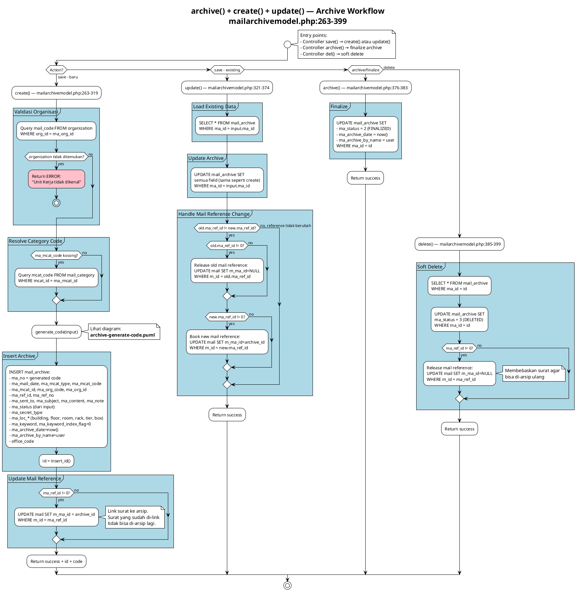
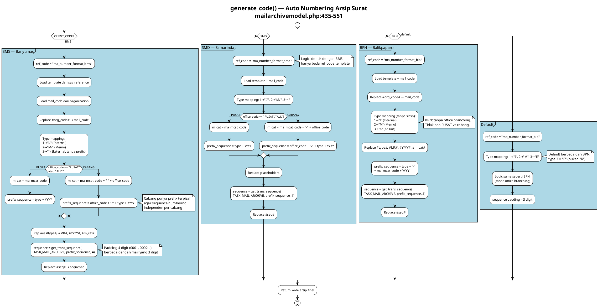
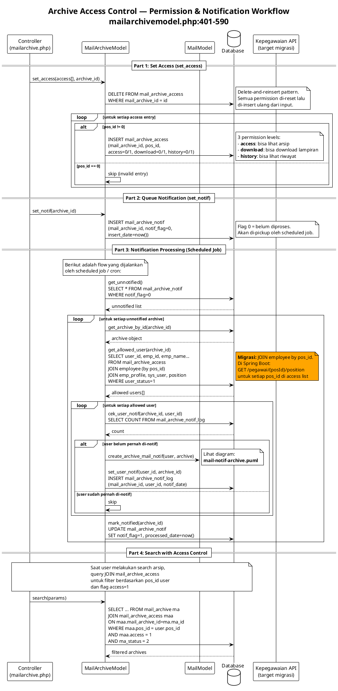

# Mail Archive — Business Logic Diagrams

> Modul arsip surat digital.
> Source: `server/application/direct/mailarchive.php` + `server/application/models/mailarchivemodel.php`

---

## archive() + create() + update() — Archive Workflow

**Source:** `mailarchivemodel.php:263-399`
**Diagram type:** Activity
**Complexity:** High

### What
Workflow arsip surat dengan 4 entry points: create (arsip baru dengan auto-numbering dan validasi organisasi), update (edit arsip existing dengan handling perubahan referensi surat), archive/finalize (set status=2), delete (soft delete status=3 dengan release referensi surat).

### Why
Arsip surat adalah proses yang melibatkan nomor arsip unik, referensi ke surat asli (m_ma_id), dan lokasi fisik penyimpanan. Referensi surat harus dikelola (book/release) agar satu surat hanya bisa di-arsip sekali.

### Diagram

### Migration Notes
- Pisahkan menjadi method terpisah di `MailArchiveService`: create(), update(), finalize(), softDelete()
- Reference management → `@Transactional` untuk atomicity
- Validasi organisasi → call Kepegawaian API

---

## generate_code() — Auto Numbering Arsip

**Source:** `mailarchivemodel.php:435-551`
**Diagram type:** Activity
**Complexity:** High

### What
Generate nomor arsip per CLIENT_CODE dengan office-based branching. BMS dan SMD memiliki logic PUSAT vs cabang (prefix_sequence berbeda, m_cat ditambah office_code untuk cabang). BPN dan default tanpa office branching.

### Why
Nomor arsip harus unik per kantor dan per tahun. Cabang punya sequence terpisah agar numbering independen.

### Diagram

### Migration Notes
- Strategy Pattern: `ArchiveCodeGenerator` per CLIENT_CODE
- Office branching → parameter di strategy, bukan if/else
- Padding 4 digit (BMS/SMD) vs 3 digit (BPN/default) → configurable

---

## Archive Access Control — Permission & Notification

**Source:** `mailarchivemodel.php:401-590`
**Diagram type:** Sequence
**Complexity:** Medium

### What
Position-based access control: set_access() delete-and-reinsert permissions per jabatan (3 level: access, download, history). Notification workflow: set_notif() queue → scheduled job picks up → get_allowed_user() resolves employees by position → cek_user_notif() prevents duplicate → create_archive_mail_notif() sends internal mail → set_user_notif() logs. Search enforces ACL via JOIN.

### Why
Arsip bersifat rahasia — akses berdasarkan jabatan (position), bukan individual. Notifikasi otomatis memastikan user yang diberi akses tahu ada arsip baru.

### Diagram

### Migration Notes
- set_access(): gunakan `@Transactional` + bulk insert (bukan delete-reinsert)
- Notification: Spring `@Scheduled` job atau event-driven
- ACL: `@PreAuthorize` custom atau Spring Security ACL module
- Employee lookup by position → Kepegawaian API: `GET /pegawai/{posId}/position`

---

