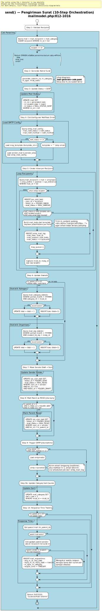
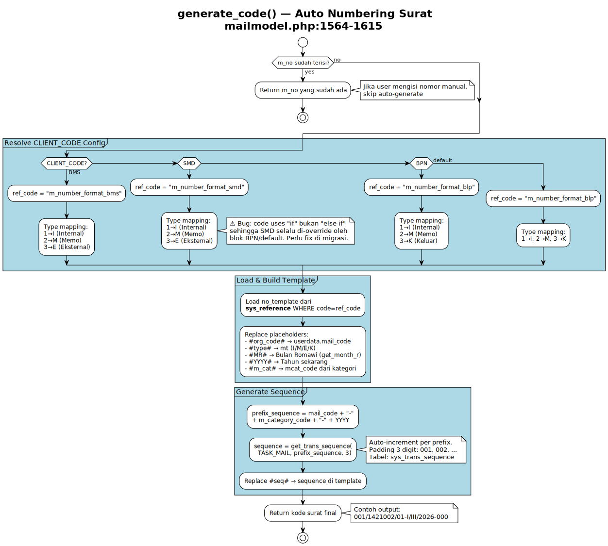
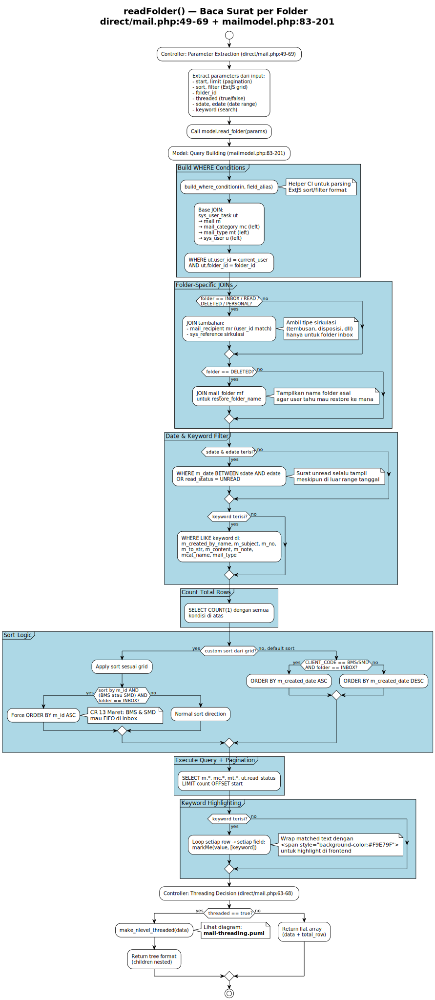
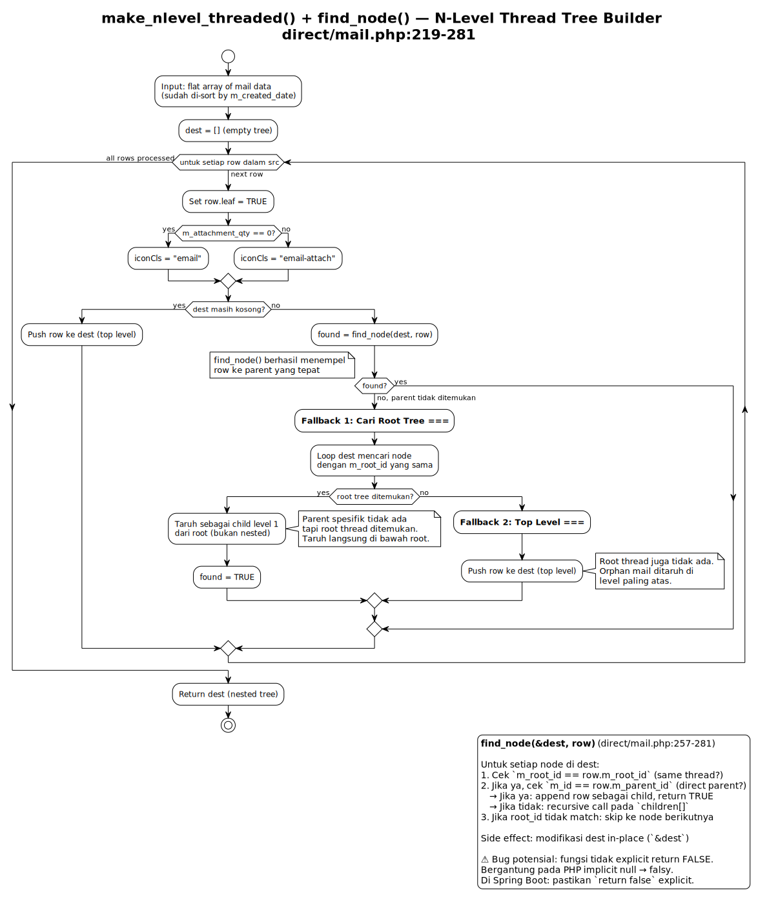
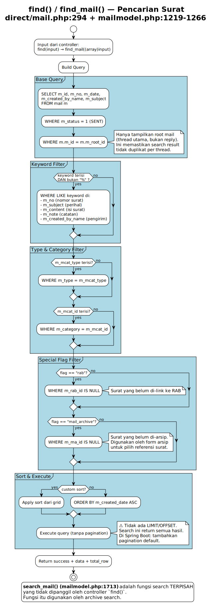
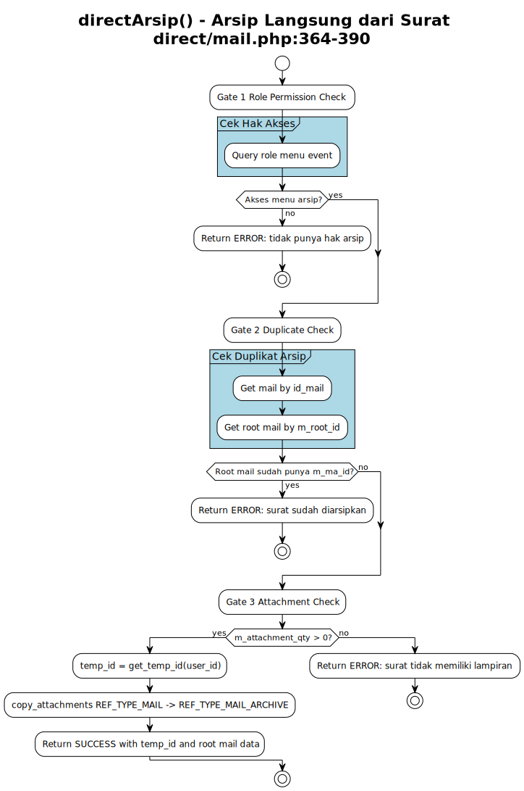
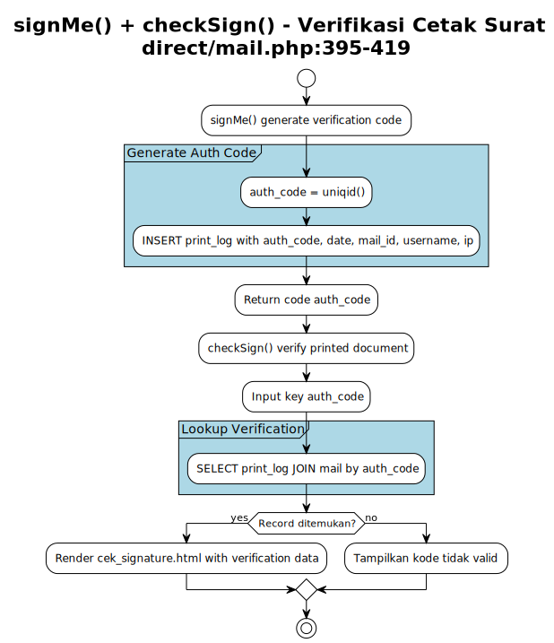
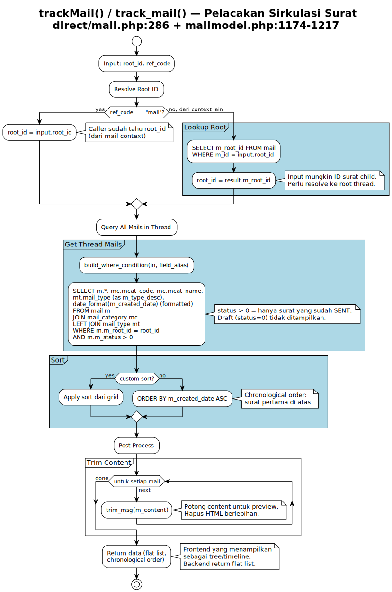
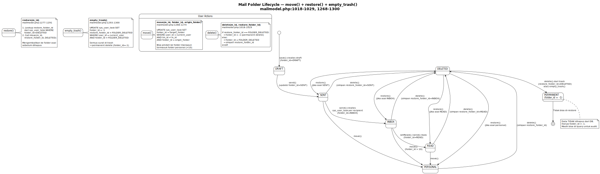

# Mail Core — Business Logic Diagrams

> Modul inti persuratan (e-Office Mail).
> Source: `server/application/direct/mail.php` + `server/application/models/mailmodel.php`

Dokumen ini dioptimalkan untuk preview GitHub menggunakan file SVG agar diagram yang panjang tetap terbaca.

## Diagram Index

| Diagram | Source Code | Type | Complexity | Preview | PlantUML |
|---|---|---|---|---|---|
| `send()` | `mailmodel.php:812-1016` | Activity | Very High | [SVG](puml/mail-send.svg) | [PUML](puml/mail-send.puml) |
| `generate_code()` | `mailmodel.php:1564-1615` | Activity | High | [SVG](puml/mail-generate-code.svg) | [PUML](puml/mail-generate-code.puml) |
| `readFolder()` | `mail.php:49-69` + `mailmodel.php:83-201` | Activity | High | [SVG](puml/mail-read-folder.svg) | [PUML](puml/mail-read-folder.puml) |
| `make_nlevel_threaded()` + `find_node()` | `mail.php:219-281` | Activity | Medium | [SVG](puml/mail-threading.svg) | [PUML](puml/mail-threading.puml) |
| `find()` / `find_mail()` | `mail.php:294` + `mailmodel.php:1219-1266` | Activity | Medium | [SVG](puml/mail-search.svg) | [PUML](puml/mail-search.puml) |
| `directArsip()` | `mail.php:364-390` | Activity | Medium | [SVG](puml/mail-direct-arsip.svg) | [PUML](puml/mail-direct-arsip.puml) |
| `signMe()` + `checkSign()` | `mail.php:395-419` | Activity | Low | [SVG](puml/mail-sign.svg) | [PUML](puml/mail-sign.puml) |
| `trackMail()` / `track_mail()` | `mail.php:286` + `mailmodel.php:1174-1217` | Activity | Medium | [SVG](puml/mail-track.svg) | [PUML](puml/mail-track.puml) |
| `move()` + `restore()` + `empty_trash()` | `mailmodel.php:1018-1029, 1268-1300` | State | Medium | [SVG](puml/mail-lifecycle.svg) | [PUML](puml/mail-lifecycle.puml) |

---

## send() — Pengiriman Surat

**Source:** `mailmodel.php:812-1016`
**Diagram type:** Activity
**Complexity:** Very High

### What
Orchestrasi pengiriman surat dengan 10 side-effects dalam satu transaksi: validasi recipient, generate nomor surat, update status, create inbox per recipient, kirim email notification, update statistik kategori dan organisasi, move draft ke sent, mark parent sebagai read (jika reply), track response time.

### Why
Ini adalah fungsi paling kritis di modul persuratan. Satu kali send() mempengaruhi banyak tabel dan external system (SMTP). Semua side-effect harus atomik — jika satu gagal, state data bisa inkonsisten.

### Diagram (SVG)

[Open full SVG](puml/mail-send.svg)

### Source Diagram

- PlantUML source: [`puml/mail-send.puml`](puml/mail-send.puml)

### Migration Notes
- Pecah 10 side-effects menjadi: core transaction (`@Transactional`) + event-driven side effects (`@Async`, `@EventListener`)
- Email notification → `MailNotificationService` (async)
- Statistik update → `MailStatisticService` (async)
- Response time → `MailResponseTimeService` (async)
- Inbox creation bisa batch INSERT untuk performance

---

## generate_code() — Auto Numbering Surat

**Source:** `mailmodel.php:1564-1615`
**Diagram type:** Activity
**Complexity:** High

### What
Generate nomor surat otomatis berdasarkan template per CLIENT_CODE. Template di-load dari sys_reference, placeholder di-replace (org_code, type, bulan romawi, tahun, kategori), sequence auto-increment per prefix.

### Why
Setiap tenant (BMS/SMD/BPN) punya format nomor surat berbeda. Sequence numbering harus unik per kombinasi mail_code + category + tahun.

### Diagram (SVG)

[Open full SVG](puml/mail-generate-code.svg)

### Source Diagram

- PlantUML source: [`puml/mail-generate-code.puml`](puml/mail-generate-code.puml)

### Migration Notes
- Implement sebagai Strategy Pattern: `MailCodeGenerator` interface dengan `BmsMailCodeGenerator`, `SmdMailCodeGenerator`, `BpnMailCodeGenerator`
- ⚠️ Bug di source: blok SMD tidak pakai `else if`, sehingga di-override oleh BPN. Fix di migrasi.
- `get_trans_sequence()` → `@Transactional` dengan `SELECT FOR UPDATE` untuk race condition safety

---

## readFolder() — Baca Surat per Folder

**Source:** `direct/mail.php:49-69` + `mailmodel.php:83-201`
**Diagram type:** Activity
**Complexity:** High

### What
Query surat berdasarkan folder (inbox/sent/draft/read/deleted/personal) dengan folder-specific JOINs, date range filter, keyword search dengan highlighting, CLIENT_CODE-specific sort order, dan optional thread tree building.

### Why
Folder view adalah tampilan utama modul persuratan. Setiap folder punya kebutuhan data berbeda (inbox perlu sirkulasi, deleted perlu restore folder name). Keyword highlighting membantu user menemukan surat yang dicari.

### Diagram (SVG)

[Open full SVG](puml/mail-read-folder.svg)

### Source Diagram

- PlantUML source: [`puml/mail-read-folder.puml`](puml/mail-read-folder.puml)

### Migration Notes
- Pecah jadi beberapa query method di Repository layer (findByFolderInbox, findByFolderSent, dll) atau gunakan Specification pattern
- Keyword highlighting → pindah ke frontend atau gunakan Spring util
- CLIENT_CODE sort logic → externalize ke configuration
- Threading → opsional di backend, bisa delegasi ke frontend

---

## make_nlevel_threaded() + find_node() — Thread Tree Builder

**Source:** `direct/mail.php:219-281`
**Diagram type:** Activity
**Complexity:** Medium

### What
Membangun n-level nested tree dari flat mail data untuk ExtJS TreePanel. Setiap mail punya m_root_id (root thread) dan m_parent_id (parent langsung). Algoritma: iterasi flat data, untuk setiap row cari parent via recursive find_node(), dengan 2-level fallback jika parent tidak ditemukan.

### Why
Thread view memungkinkan user melihat percakapan surat (reply chain) sebagai tree. Flat data dari DB perlu dikonversi ke nested structure untuk tree component di frontend.

### Diagram (SVG)

[Open full SVG](puml/mail-threading.svg)

### Source Diagram

- PlantUML source: [`puml/mail-threading.puml`](puml/mail-threading.puml)

### Migration Notes
- Bisa tetap in-memory tree building di `MailThreadService.buildTree()`
- Alternatif: recursive CTE query di database level
- ⚠️ find_node() tidak explicit return FALSE — fix di migrasi
- Pertimbangkan pagination per thread (lazy load children)

---

## find() / find_mail() — Pencarian Surat

**Source:** `direct/mail.php:294` + `mailmodel.php:1219-1266`
**Diagram type:** Activity
**Complexity:** Medium

### What
Pencarian surat dengan multi-field keyword (nomor, perihal, isi, catatan, pengirim), filter by type/category, special flags (belum di-RAB, belum di-arsip). Hanya return root mails (bukan reply).

### Why
Digunakan untuk mencari surat saat membuat arsip atau menghubungkan surat ke RAB. Filter `m_id = m_root_id` memastikan tidak ada duplikat thread.

### Diagram (SVG)

[Open full SVG](puml/mail-search.svg)

### Source Diagram

- PlantUML source: [`puml/mail-search.puml`](puml/mail-search.puml)

### Migration Notes
- Tambahkan pagination (saat ini tanpa LIMIT)
- Pertimbangkan full-text search (Elasticsearch) untuk performance
- `search_mail()` (mailmodel.php:1713) adalah fungsi terpisah — digunakan oleh archive search, bukan controller find()

---

## directArsip() — Arsip Langsung dari Surat

**Source:** `direct/mail.php:364-390`
**Diagram type:** Activity
**Complexity:** Medium

### What
Validasi 3-gate sebelum mengarsip surat: (1) cek role permission untuk menu arsip, (2) cek apakah surat sudah pernah di-arsip (duplikat), (3) cek lampiran (wajib ada). Jika lolos, copy attachments dari context surat ke context arsip.

### Why
Arsip surat memerlukan attachment (sebagai bukti fisik digital). Duplikat arsip dicegah dengan pengecekan m_ma_id di root mail. Role-based access memastikan hanya user berwenang yang bisa arsip.

### Diagram (SVG)

[Open full SVG](puml/mail-direct-arsip.svg)

### Source Diagram

- PlantUML source: [`puml/mail-direct-arsip.puml`](puml/mail-direct-arsip.puml)

### Migration Notes
- Gate 1: `@PreAuthorize` dengan custom permission check
- Gate 2-3: validation logic di `ArchiveService`
- Copy attachment: `AttachmentService.copyAttachments()`

---

## signMe() + checkSign() — Verifikasi Cetak Surat

**Source:** `direct/mail.php:395-419`
**Diagram type:** Activity
**Complexity:** Low

### What
signMe(): Generate unique verification code (uniqid) saat user mencetak surat. Simpan ke print_log dengan username, tanggal, IP. checkSign(): Lookup print_log by auth_code, tampilkan halaman verifikasi.

### Why
Memungkinkan verifikasi keaslian dokumen cetak. Pemegang dokumen fisik bisa cek apakah dokumen valid dengan memasukkan kode verifikasi.

### Diagram (SVG)

[Open full SVG](puml/mail-sign.svg)

### Source Diagram

- PlantUML source: [`puml/mail-sign.puml`](puml/mail-sign.puml)

### Migration Notes
- Ganti `uniqid()` dengan `UUID.randomUUID()` atau JWT
- `checkSign()` → `GET /api/mails/verify-sign/{key}` return JSON (bukan HTML)
- Pertimbangkan QR code yang berisi URL verifikasi

---

## trackMail() / track_mail() — Pelacakan Sirkulasi Surat

**Source:** `direct/mail.php:286` + `mailmodel.php:1174-1217`
**Diagram type:** Activity
**Complexity:** Medium

### What
Menampilkan seluruh surat dalam satu thread (berdasarkan m_root_id) secara chronological. Resolve root_id jika input adalah child mail. Trim content untuk preview.

### Why
Tracking memungkinkan user melihat riwayat sirkulasi surat: siapa yang mengirim, kapan dibalas, berapa kali beredar.

### Diagram (SVG)

[Open full SVG](puml/mail-track.svg)

### Source Diagram

- PlantUML source: [`puml/mail-track.puml`](puml/mail-track.puml)

### Migration Notes
- Bisa gunakan recursive CTE untuk mendapat tree + metadata
- Content trimming → utility method
- Pertimbangkan caching untuk thread yang sering diakses

---

## move() + restore() + empty_trash() — Mail Folder Lifecycle

**Source:** `mailmodel.php:1018-1029, 1268-1300`
**Diagram type:** Activity (State Diagram)
**Complexity:** Medium

### What
Tiga operasi yang mengubah state folder surat: move() memindahkan ke folder target, restore() mengembalikan dari trash ke folder asal (via restore_folder_id), empty_trash() menghapus permanen semua surat di trash (folder_id = -1).

### Why
Lifecycle folder memastikan user bisa mengelola surat (pindah, hapus, restore). Soft delete via folder_id memungkinkan restore. Permanent delete (folder_id=-1) hanya mengubah flag — data tetap di DB untuk audit.

### Diagram (SVG)

[Open full SVG](puml/mail-lifecycle.svg)

### Source Diagram

- PlantUML source: [`puml/mail-lifecycle.puml`](puml/mail-lifecycle.puml)

### Migration Notes
- Pertimbangkan enum MailFolder instead of magic numbers
- empty_trash: batch operation, bisa async untuk large mailbox
- Soft delete pattern → `@SQLRestriction` di JPA entity

---

