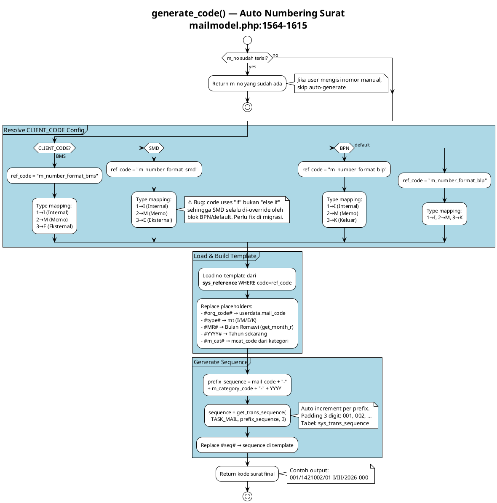
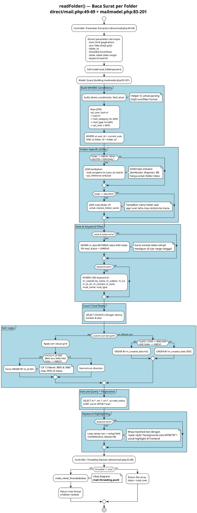
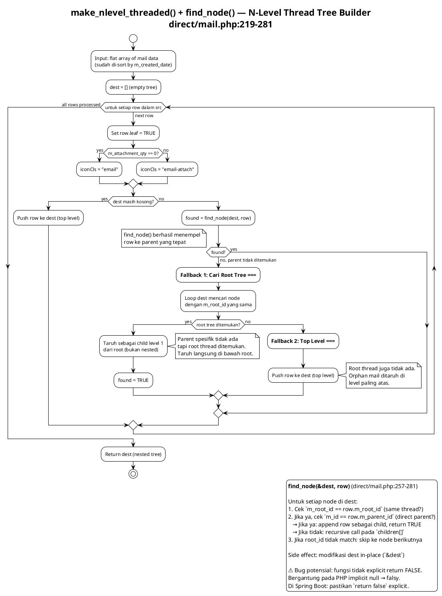
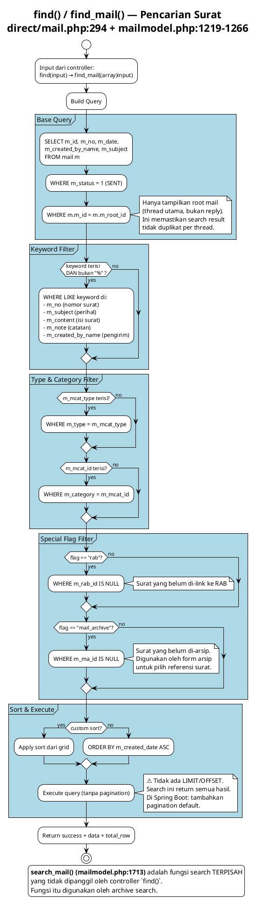
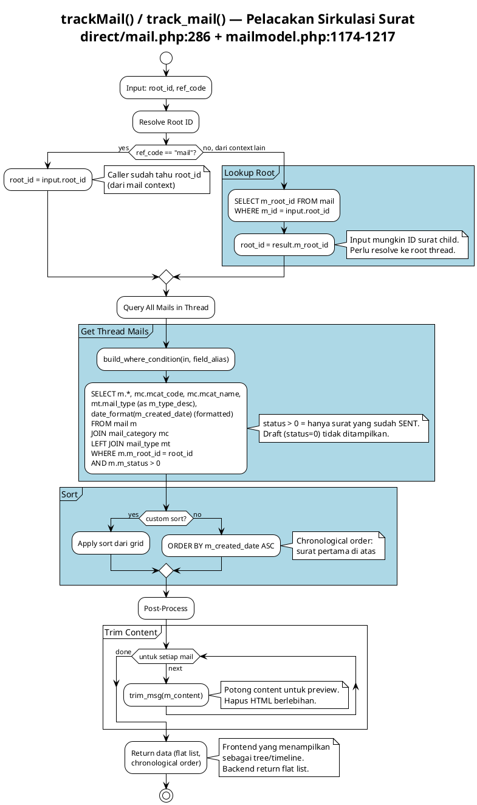
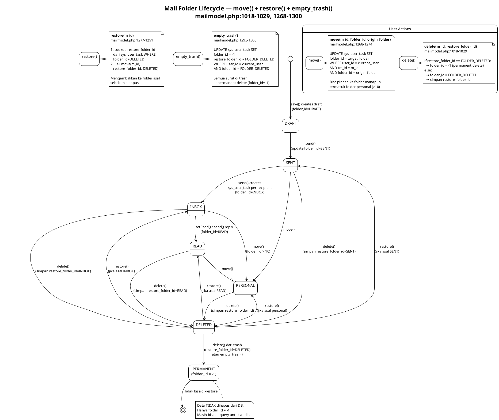

```plantuml
@startuml
!theme plain
title send() — Pengiriman Surat (10-Step Orchestration)\nmailmodel.php:812-1016

start

:Step 1: Validasi Recipient;

partition "Cek Penerima" #LightBlue {
  :Query mail + mail_recipient + mail_category
  COUNT recipient WHERE m_id = tid;

  if (recipient == 0?) then (yes)
    :Return ERROR:\nDaftar penerima belum ada;#Pink
    stop
  else (no)
  endif
}

:Step 2: Generate Nomor Surat;

:generate_code(m_no, m_category,
m_type, mcat_code);
note right
  Lihat diagram:
  **mail-generate-code.puml**
  Skip jika m_no sudah terisi
end note

:Step 3: Update Status → SENT;

partition "Update Mail Status" #LightBlue {
  :UPDATE mail SET
  - m_no = generated code
  - m_created_date = now()
  - m_status = MAIL_STATUS_SENT
  WHERE m_id = tid;
}

:Step 4: Cek Konfigurasi Notifikasi Email;

partition "Load SMTP Config" #LightBlue {
  :Query smtp_mail_config:
  - mail_notif_status → notif_status
  - mail_notif_method → notif_method;

  if (notif_status == 1?) then (yes)
    :Load msg_template (template_id=1);
    :Load sender_mail & sender_alias
    dari smtp_mail_config;
  else (no)
    :template = "" (skip email);
  endif
}

:Step 5: Create Inbox per Recipient;

partition "Loop Recipients" #LightBlue {
  :Query mail_recipient + mail + employee
  + emp_profile + position + sys_reference
  WHERE mail_id = tid;

  while (untuk setiap recipient) is (next)
    :INSERT sys_user_task:
    - user_id = recipient
    - folder_id = FOLDER_INBOX
    - read_status = MAIL_UNREAD;

    if (notif_status=1 AND template ada\nAND recipient.email=1\nAND emp_email tidak kosong?) then (yes)
      :Build mail_body dari template
      (replace placeholders per field);
      note right
        Trim m_content: potong
        <div style="margin-left:20px...">
        agar email tidak terlalu panjang
      end note
      :INSERT smtp_mail_log:
      - mail_from, mail_to
      - mail_subject, mail_body
      - mail_status = 0 (queued);
      :msg_queue++;
    else (no)
    endif

    :Capture mcat_id, morg_id
    dari row terakhir;
  endwhile (done)
}

:Step 6: Update Statistik;

if (m_parent_id == 0?\n(bukan reply, surat baru)) then (yes)
  partition "Statistik Kategori" #LightBlue {
    :Query mail_category_statistic
    WHERE period_month = YYYYMM
    AND category_id = mcat_id;

    if (record exists?) then (yes)
      :UPDATE total = total + 1;
    else (no)
      :INSERT baru (total=1);
    endif
  }

  partition "Statistik Organisasi" #LightBlue {
    :Query mail_org_statistic
    WHERE period_month = YYYYMM
    AND created_by_org = morg_id;

    if (record exists?) then (yes)
      :UPDATE total = total + 1;
    else (no)
      :INSERT baru (total=1);
    endif
  }
else (no, ini reply)
endif

:Step 7: Move Sender Draft → Sent;

partition "Update Sender Folder" #LightBlue {
  :UPDATE sys_user_task SET
  - folder_id = FOLDER_SENT
  - read_status = MAIL_READ
  WHERE user_id = sender
  AND tm_id = tid
  AND folder_id = FOLDER_DRAFT;
}

:Step 8: Mark Parent as READ (jika reply);

if (m_parent_id != 0\nAND m_folder_id != FOLDER_SENT\nAND m_folder_id < 10?) then (yes)
  partition "Mark Parent Read" #LightBlue {
    :UPDATE sys_user_task SET
    - folder_id = FOLDER_READ
    - read_status = MAIL_READ
    WHERE user_id = sender
    AND tm_id = m_parent_id;
  }
else (no)
endif

:Step 9: Trigger SMTP (jika realtime);

if (msg_queue > 0\nAND notif_method == 1?) then (yes)
  :Load smtpmodel;
  :smtp->send(tid);
  note right
    Kirim email langsung (realtime).
    Jika method != 1, email dikirim
    via scheduled job dari smtp_mail_log
  end note
else (no)
endif

:Step 9b: Update Category Sort Counter;

partition "Update Sort" #LightBlue {
  :UPDATE mail_category SET
  sort = sort + 1
  WHERE mcat_id = mcat_id;
}

:Step 10: Response Time Tracking;

if (m_parent_id != 0?\n(ini adalah reply)) then (yes)
  partition "Response Time" #LightBlue {
    :Get parent mail (m_parent_id);

    if (parent mail exists?) then (yes)
      :Cek apakah parent sender
      ada di recipient list surat ini;

      if (parent sender is recipient?\n(ini mail response)) then (yes)
        :INSERT mail_respontime:
        - orig_m_id, orig_date
        - reply_m_id, reply_date = now()
        - m_type, m_category
        - respon_time = TIMEDIFF;
        note right
          Mengukur waktu respon:
          berapa lama dari surat asli
          sampai dibalas
        end note
      else (no)
      endif
    else (no)
    endif
  }
else (no)
endif

:Return SUCCESS:
"Surat berhasil dikirim";

stop

@enduml
```

# Mail Core — Business Logic Diagrams

> Modul inti persuratan (e-Office Mail).
> Source: `server/application/direct/mail.php` + `server/application/models/mailmodel.php`

---

## send() — Pengiriman Surat

**Source:** `mailmodel.php:812-1016`
**Diagram type:** Activity
**Complexity:** Very High

### What
Orchestrasi pengiriman surat dengan 10 side-effects dalam satu transaksi: validasi recipient, generate nomor surat, update status, create inbox per recipient, kirim email notification, update statistik kategori dan organisasi, move draft ke sent, mark parent sebagai read (jika reply), track response time.

### Why
Ini adalah fungsi paling kritis di modul persuratan. Satu kali send() mempengaruhi banyak tabel dan external system (SMTP). Semua side-effect harus atomik — jika satu gagal, state data bisa inkonsisten.

### Diagram



### Migration Notes
- Pecah 10 side-effects menjadi: core transaction (`@Transactional`) + event-driven side effects (`@Async`, `@EventListener`)
- Email notification → `MailNotificationService` (async)
- Statistik update → `MailStatisticService` (async)
- Response time → `MailResponseTimeService` (async)
- Inbox creation bisa batch INSERT untuk performance

---

## generate_code() — Auto Numbering Surat

**Source:** `mailmodel.php:1564-1615`
**Diagram type:** Activity
**Complexity:** High

### What
Generate nomor surat otomatis berdasarkan template per CLIENT_CODE. Template di-load dari sys_reference, placeholder di-replace (org_code, type, bulan romawi, tahun, kategori), sequence auto-increment per prefix.

### Why
Setiap tenant (BMS/SMD/BPN) punya format nomor surat berbeda. Sequence numbering harus unik per kombinasi mail_code + category + tahun.

### Diagram



### Migration Notes
- Implement sebagai Strategy Pattern: `MailCodeGenerator` interface dengan `BmsMailCodeGenerator`, `SmdMailCodeGenerator`, `BpnMailCodeGenerator`
- ⚠️ Bug di source: blok SMD tidak pakai `else if`, sehingga di-override oleh BPN. Fix di migrasi.
- `get_trans_sequence()` → `@Transactional` dengan `SELECT FOR UPDATE` untuk race condition safety

---

## readFolder() — Baca Surat per Folder

**Source:** `direct/mail.php:49-69` + `mailmodel.php:83-201`
**Diagram type:** Activity
**Complexity:** High

### What
Query surat berdasarkan folder (inbox/sent/draft/read/deleted/personal) dengan folder-specific JOINs, date range filter, keyword search dengan highlighting, CLIENT_CODE-specific sort order, dan optional thread tree building.

### Why
Folder view adalah tampilan utama modul persuratan. Setiap folder punya kebutuhan data berbeda (inbox perlu sirkulasi, deleted perlu restore folder name). Keyword highlighting membantu user menemukan surat yang dicari.

### Diagram



### Migration Notes
- Pecah jadi beberapa query method di Repository layer (findByFolderInbox, findByFolderSent, dll) atau gunakan Specification pattern
- Keyword highlighting → pindah ke frontend atau gunakan Spring util
- CLIENT_CODE sort logic → externalize ke configuration
- Threading → opsional di backend, bisa delegasi ke frontend

---

## make_nlevel_threaded() + find_node() — Thread Tree Builder

**Source:** `direct/mail.php:219-281`
**Diagram type:** Activity
**Complexity:** Medium

### What
Membangun n-level nested tree dari flat mail data untuk ExtJS TreePanel. Setiap mail punya m_root_id (root thread) dan m_parent_id (parent langsung). Algoritma: iterasi flat data, untuk setiap row cari parent via recursive find_node(), dengan 2-level fallback jika parent tidak ditemukan.

### Why
Thread view memungkinkan user melihat percakapan surat (reply chain) sebagai tree. Flat data dari DB perlu dikonversi ke nested structure untuk tree component di frontend.

### Diagram



### Migration Notes
- Bisa tetap in-memory tree building di `MailThreadService.buildTree()`
- Alternatif: recursive CTE query di database level
- ⚠️ find_node() tidak explicit return FALSE — fix di migrasi
- Pertimbangkan pagination per thread (lazy load children)

---

## find() / find_mail() — Pencarian Surat

**Source:** `direct/mail.php:294` + `mailmodel.php:1219-1266`
**Diagram type:** Activity
**Complexity:** Medium

### What
Pencarian surat dengan multi-field keyword (nomor, perihal, isi, catatan, pengirim), filter by type/category, special flags (belum di-RAB, belum di-arsip). Hanya return root mails (bukan reply).

### Why
Digunakan untuk mencari surat saat membuat arsip atau menghubungkan surat ke RAB. Filter `m_id = m_root_id` memastikan tidak ada duplikat thread.

### Diagram



### Migration Notes
- Tambahkan pagination (saat ini tanpa LIMIT)
- Pertimbangkan full-text search (Elasticsearch) untuk performance
- `search_mail()` (mailmodel.php:1713) adalah fungsi terpisah — digunakan oleh archive search, bukan controller find()

---

## directArsip() — Arsip Langsung dari Surat

**Source:** `direct/mail.php:364-390`
**Diagram type:** Activity
**Complexity:** Medium

### What
Validasi 3-gate sebelum mengarsip surat: (1) cek role permission untuk menu arsip, (2) cek apakah surat sudah pernah di-arsip (duplikat), (3) cek lampiran (wajib ada). Jika lolos, copy attachments dari context surat ke context arsip.

### Why
Arsip surat memerlukan attachment (sebagai bukti fisik digital). Duplikat arsip dicegah dengan pengecekan m_ma_id di root mail. Role-based access memastikan hanya user berwenang yang bisa arsip.

### Diagram

```plantuml
@startuml
!theme plain
title directArsip() — Arsip Langsung dari Surat\ndirect/mail.php:364-390

start

:Gate 1: Role Permission Check;

partition "Cek Hak Akses" #LightBlue {
  :Query sys_role_menu_event
  WHERE role_id = user.role_id
  AND menu_id = ID_MENU_ARSIP
  AND menu_event_id = 1;

  if (user punya akses menu arsip?) then (no)
    :Return ERROR: "Anda tidak memiliki hak\nuntuk melakukan pengarsipan surat";<<#Pink>>
    stop
  else (yes)
  endif
}

:Gate 2: Duplicate Check;

partition "Cek Duplikat Arsip" #LightBlue {
  :Get mail data WHERE m_id = id_mail;
  :Get root mail WHERE m_id = mail.m_root_id;

  if (root mail sudah punya m_ma_id?\n(sudah di-arsip)) then (yes)
    :Get arsip data dari mail_archive
    WHERE ma_id = root.m_ma_id;
    :Return ERROR: "Surat ini sudah pernah diarsipkan oleh\n<b>{arsip.ma_archive_by_name}</b>\ndengan nomor arsip <b>{arsip.ma_no}</b>";<<#Pink>>
    stop
  else (no, belum di-arsip)
  endif
}

:Gate 3: Attachment Check;

if (mail.m_attachment_qty > 0?) then (yes)

  partition "Copy Attachments" #LightBlue {
    :temp_id = get_temp_id(user_id);

    :attachment.copy_attachments(
    temp_id, id_mail,
    REF_TYPE_MAIL → REF_TYPE_MAIL_ARCHIVE);
    note right
      Copy lampiran dari context surat
      ke context arsip dengan temp_id baru.
      Arsip WAJIB punya lampiran.
    end note
  }

  :Return SUCCESS:\n- temp_id (untuk form arsip)\n- root mail data (m_content stripped);

else (no, tidak ada lampiran)
  :Return ERROR: "Surat ini tidak memiliki lampiran.\nAnda tidak dapat melanjutkan\nproses pengarsipan.";<<#Pink>>
  stop
endif

stop
@enduml
```

### Migration Notes
- Gate 1: `@PreAuthorize` dengan custom permission check
- Gate 2-3: validation logic di `ArchiveService`
- Copy attachment: `AttachmentService.copyAttachments()`

---

## signMe() + checkSign() — Verifikasi Cetak Surat

**Source:** `direct/mail.php:395-419`
**Diagram type:** Activity
**Complexity:** Low

### What
signMe(): Generate unique verification code (uniqid) saat user mencetak surat. Simpan ke print_log dengan username, tanggal, IP. checkSign(): Lookup print_log by auth_code, tampilkan halaman verifikasi.

### Why
Memungkinkan verifikasi keaslian dokumen cetak. Pemegang dokumen fisik bisa cek apakah dokumen valid dengan memasukkan kode verifikasi.

### Diagram

```plantuml
@startuml
title signMe() + checkSign() - Verifikasi Cetak Surat\ndirect/mail.php:395-419

start

:signMe() - Generate Verification Code;
:User mencetak surat (print action);

:auth_code = uniqid();
note right
  PHP uniqid() menghasilkan
  unique ID berbasis timestamp.
  Ini bukan digital signature asli.
  Migrasi: gunakan UUID atau JWT.
end note

:INSERT print_log;
note right
  Simpan field:
  - auth_code
  - date
  - mail_id
  - username
  - ip_address
end note

:Return { code: auth_code };

:checkSign() - Verify Printed Document;

:Input: key (auth_code dari dokumen);

:SELECT print_log JOIN mail\nWHERE auth_code = key;

if (record ditemukan?) then (yes)
  :Render cek_signature.html\ndengan data signer, tanggal,\nperihal, isi, dan kode verifikasi;
  note right
    Halaman ini bisa diakses publik
    untuk verifikasi dokumen cetak.
    Migrasi: map ke
    GET /api/mails/verify-sign/{key}
    Return JSON, bukan HTML.
  end note
else (no)
  :Tampilkan halaman "Kode tidak valid";<<#Pink>>
endif

stop
@enduml
```

### Migration Notes
- Ganti `uniqid()` dengan `UUID.randomUUID()` atau JWT
- `checkSign()` → `GET /api/mails/verify-sign/{key}` return JSON (bukan HTML)
- Pertimbangkan QR code yang berisi URL verifikasi

---

## trackMail() / track_mail() — Pelacakan Sirkulasi Surat

**Source:** `direct/mail.php:286` + `mailmodel.php:1174-1217`
**Diagram type:** Activity
**Complexity:** Medium

### What
Menampilkan seluruh surat dalam satu thread (berdasarkan m_root_id) secara chronological. Resolve root_id jika input adalah child mail. Trim content untuk preview.

### Why
Tracking memungkinkan user melihat riwayat sirkulasi surat: siapa yang mengirim, kapan dibalas, berapa kali beredar.

### Diagram



### Migration Notes
- Bisa gunakan recursive CTE untuk mendapat tree + metadata
- Content trimming → utility method
- Pertimbangkan caching untuk thread yang sering diakses

---

## move() + restore() + empty_trash() — Mail Folder Lifecycle

**Source:** `mailmodel.php:1018-1029, 1268-1300`
**Diagram type:** Activity (State Diagram)
**Complexity:** Medium

### What
Tiga operasi yang mengubah state folder surat: move() memindahkan ke folder target, restore() mengembalikan dari trash ke folder asal (via restore_folder_id), empty_trash() menghapus permanen semua surat di trash (folder_id = -1).

### Why
Lifecycle folder memastikan user bisa mengelola surat (pindah, hapus, restore). Soft delete via folder_id memungkinkan restore. Permanent delete (folder_id=-1) hanya mengubah flag — data tetap di DB untuk audit.

### Diagram



### Migration Notes
- Pertimbangkan enum MailFolder instead of magic numbers
- empty_trash: batch operation, bisa async untuk large mailbox
- Soft delete pattern → `@SQLRestriction` di JPA entity

---

