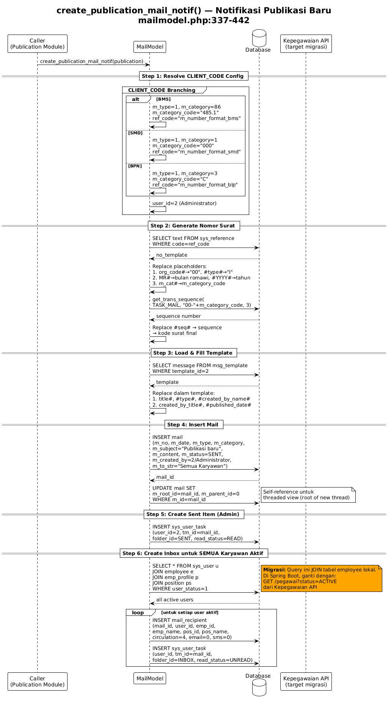
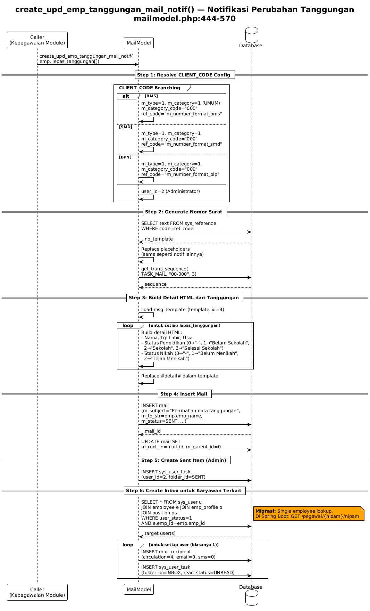

# Mail Support — Category, Type, Statistic & System Notifications

> Module pendukung dan notifikasi otomatis.
> Source: `server/application/models/mailcategorymodel.php`, `mailtypemodel.php`, `mailstatisticreportmodel.php`, `mailmodel.php`

---

## Mail Category (Klasifikasi Surat) — CRUD Ringkasan

**Source:** `mailcategorymodel.php`
**Complexity:** Low (CRUD sederhana, tidak perlu diagram)

| Function | Description | Spring Boot |
|----------|-------------|-------------|
| `read()` | List kategori dengan paginasi + sort | `GET /api/mail-categories` |
| `save()` | Create/update kategori | `POST /api/mail-categories` |
| `del()` | Soft delete kategori | `DELETE /api/mail-categories/{id}` |

### Migration Notes
- Standard JPA CRUD. Gunakan `JpaRepository<MailCategory, Long>`.
- Field `sort` di-increment saat send() — pertahankan behavior ini.

---

## Mail Type (Jenis Surat) — CRUD Ringkasan

**Source:** `mailtypemodel.php`
**Complexity:** Low (CRUD sederhana, tidak perlu diagram)

| Function | Description | Spring Boot |
|----------|-------------|-------------|
| `read()` | List jenis surat dengan paginasi | `GET /api/mail-types` |
| `read_tree()` | Hierarchical tree view | `GET /api/mail-types/tree` |
| `save()` | Create/update jenis surat | `POST /api/mail-types` |
| `del()` | Soft delete | `DELETE /api/mail-types/{id}` |

### Migration Notes
- `read_tree()`: return tree structure. Bisa recursive CTE atau in-memory tree building.

---

## Mail Statistic Report — Ringkasan

**Source:** `mailstatisticreportmodel.php`
**Complexity:** Low (aggregation query)

| Function | Description | Spring Boot |
|----------|-------------|-------------|
| `getStatistic()` | Aggregation per period + category/org | `GET /api/reports/mail-statistics` |

### Migration Notes
- Native query atau `@Query` JPQL dengan GROUP BY.
- Data source: `mail_category_statistic` dan `mail_org_statistic` (di-maintain oleh send()).

---

## System Notification Diagrams

### Shared Pattern (Referensi `index-mail-core.md`)

Empat function notifikasi di bawah mengikuti orkestrasi yang sama seperti pola di `send()` + `generate_code()` pada `index-mail-core.md`, dengan variasi di sumber recipient dan template payload.

1. Resolve `CLIENT_CODE` config (`m_type`, `m_category`, `m_category_code`, `ref_code`)
2. Generate nomor surat (reuse flow `generate_code()`)
3. Load template + replace placeholder context
4. Insert `mail` + set `m_root_id` / `m_parent_id`
5. Insert `sys_user_task` sender ke folder `SENT`
6. Insert recipient (`mail_recipient`) + inbox (`sys_user_task`)

Optimasi migrasi mengikuti referensi core:
- Reuse service `MailCodeGenerator` (Strategy per `CLIENT_CODE`) untuk semua notification builder.
- Reuse helper `createInternalMailAndSentItem(...)` agar logic Step 4-5 tidak duplikatif.
- Recipient fan-out (single/multi/all employee) dipisah ke `RecipientResolver` + batch insert.

### create_publication_mail_notif() — Notifikasi Publikasi

**Source:** `mailmodel.php:337-442`
**Diagram type:** Sequence
**Complexity:** High

### What
Membuat surat notifikasi internal saat ada publikasi baru. Dikirim ke SEMUA karyawan aktif sebagai inbox. Mewarisi shared pattern notifikasi, dengan perbedaan utama: recipient adalah broadcast user aktif dan template menggunakan `msg_template(2)`.

### Why
Publikasi (pengumuman perusahaan) harus sampai ke semua karyawan. Sistem otomatis membuat surat internal agar muncul di inbox setiap user.

### Diagram (PNG)

[Open full PNG](puml/mail-notif-publication.png)

### Source Diagram

- PlantUML source: [`puml/mail-notif-publication.puml`](puml/mail-notif-publication.puml)

### Migration Notes
- Broadcast ke semua user → potentially slow. Gunakan `@Async` + batch insert.
- Employee list → Kepegawaian API: `GET /pegawai?status=ACTIVE`
- Extract ke `SystemMailNotificationService` yang reusable.
- Reuse `MailCodeGenerator` dari referensi `index-mail-core.md` (`generate_code()`).

---

### create_upd_emp_tanggungan_mail_notif() — Notifikasi Tanggungan

**Source:** `mailmodel.php:444-570`
**Diagram type:** Sequence
**Complexity:** Medium

### What
Notifikasi ke karyawan saat data tanggungan berubah (anak lepas tanggungan karena usia/pendidikan/nikah). Mewarisi shared pattern notifikasi, dengan perbedaan utama: payload `#detail#` dibangun dari array `lepas_tanggungan` menggunakan `msg_template(4)`.

### Why
Perubahan tanggungan mempengaruhi tunjangan. Karyawan perlu tahu agar bisa verifikasi.

### Diagram (PNG)

[Open full PNG](puml/mail-notif-tanggungan.png)

### Source Diagram

- PlantUML source: [`puml/mail-notif-tanggungan.puml`](puml/mail-notif-tanggungan.puml)

### Migration Notes
- Detail HTML building → Thymeleaf template atau utility method
- Trigger dari modul Kepegawaian via Spring Event
- Reuse `MailCodeGenerator` dari referensi `index-mail-core.md` (`generate_code()`).

---

### create_approval_cuti_notif() — Notifikasi Cuti

**Source:** `mailmodel.php:572-675`
**Diagram type:** Sequence
**Complexity:** Medium

### What
Notifikasi approval/rejection cuti ke karyawan. Mewarisi shared pattern notifikasi, dengan perbedaan utama: `subject` dan `msg_tpl` di-pass dari caller (generic template-driven notification).

### Why
Karyawan perlu notifikasi saat pengajuan cuti di-approve atau di-reject.

### Diagram (PNG)

[Open full PNG](puml/mail-notif-cuti.png)

### Source Diagram

- PlantUML source: [`puml/mail-notif-cuti.puml`](puml/mail-notif-cuti.puml)

### Migration Notes
- Caller passing subject + template → generic notification pattern
- Bisa di-generalize menjadi method dengan template + context params
- Reuse `MailCodeGenerator` dari referensi `index-mail-core.md` (`generate_code()`).

---

### create_archive_mail_notif() — Notifikasi Arsip

**Source:** `mailmodel.php:1617-1711`
**Diagram type:** Sequence
**Complexity:** Medium

### What
Notifikasi ke user yang diberi hak akses arsip baru. Mewarisi shared pattern notifikasi, dengan perbedaan utama: recipient sudah resolved dari caller (`get_allowed_user`) dan payload template(3) menggunakan field arsip (`ma_no`, `ma_subject`, `ma_archive_by_name`, `ma_secret_type`).

### Why
User yang diberi akses arsip perlu tahu agar bisa mengakses dokumen.

### Diagram (PNG)

[Open full PNG](puml/mail-notif-archive.png)

### Source Diagram

- PlantUML source: [`puml/mail-notif-archive.puml`](puml/mail-notif-archive.puml)

### Migration Notes
- Dipanggil oleh scheduled notification job (bukan realtime)
- User object dari Kepegawaian API (via get_allowed_user)
- Reuse `MailCodeGenerator` dari referensi `index-mail-core.md` (`generate_code()`).

---

