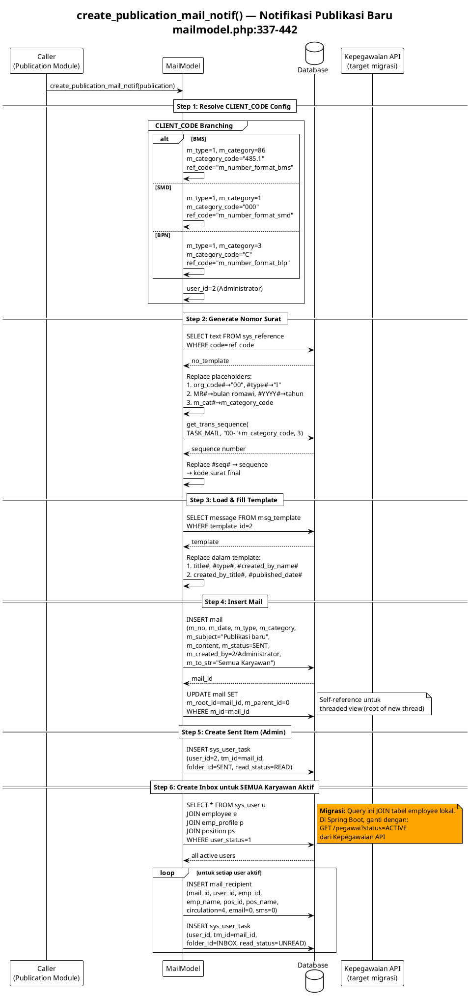
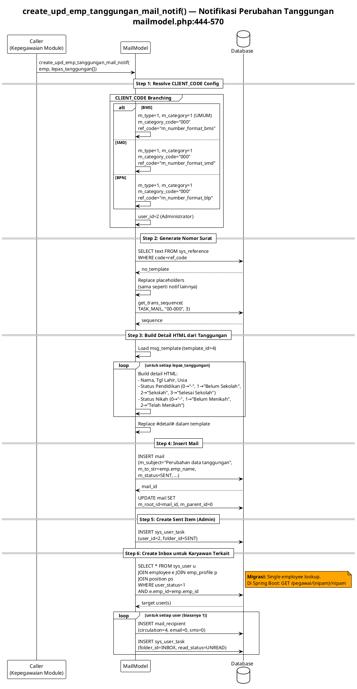
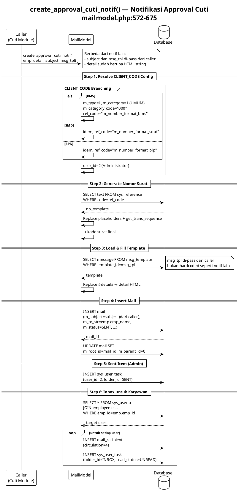
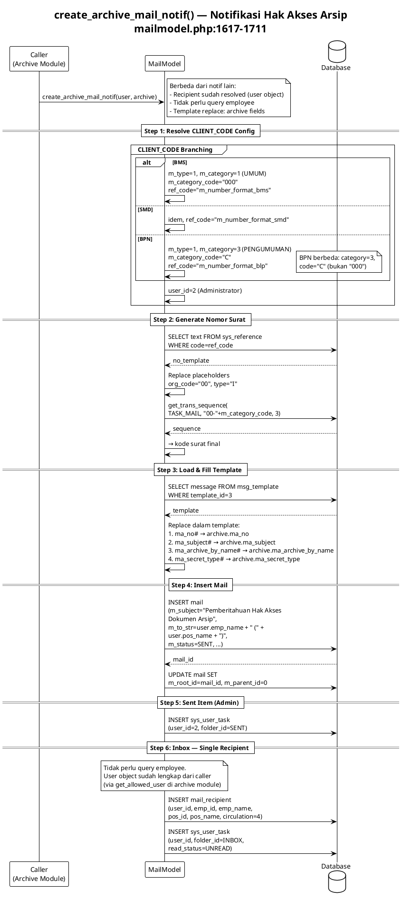

# Mail Support — Category, Type, Statistic & System Notifications

> Module pendukung dan notifikasi otomatis.
> Source: `server/application/models/mailcategorymodel.php`, `mailtypemodel.php`, `mailstatisticreportmodel.php`, `mailmodel.php`

---

## Mail Category (Klasifikasi Surat) — CRUD Ringkasan

**Source:** `mailcategorymodel.php`
**Complexity:** Low (CRUD sederhana, tidak perlu diagram)

| Function | Description | Spring Boot |
|----------|-------------|-------------|
| `read()` | List kategori dengan paginasi + sort | `GET /api/mail-categories` |
| `save()` | Create/update kategori | `POST /api/mail-categories` |
| `del()` | Soft delete kategori | `DELETE /api/mail-categories/{id}` |

### Migration Notes
- Standard JPA CRUD. Gunakan `JpaRepository<MailCategory, Long>`.
- Field `sort` di-increment saat send() — pertahankan behavior ini.

---

## Mail Type (Jenis Surat) — CRUD Ringkasan

**Source:** `mailtypemodel.php`
**Complexity:** Low (CRUD sederhana, tidak perlu diagram)

| Function | Description | Spring Boot |
|----------|-------------|-------------|
| `read()` | List jenis surat dengan paginasi | `GET /api/mail-types` |
| `read_tree()` | Hierarchical tree view | `GET /api/mail-types/tree` |
| `save()` | Create/update jenis surat | `POST /api/mail-types` |
| `del()` | Soft delete | `DELETE /api/mail-types/{id}` |

### Migration Notes
- `read_tree()`: return tree structure. Bisa recursive CTE atau in-memory tree building.

---

## Mail Statistic Report — Ringkasan

**Source:** `mailstatisticreportmodel.php`
**Complexity:** Low (aggregation query)

| Function | Description | Spring Boot |
|----------|-------------|-------------|
| `getStatistic()` | Aggregation per period + category/org | `GET /api/reports/mail-statistics` |

### Migration Notes
- Native query atau `@Query` JPQL dengan GROUP BY.
- Data source: `mail_category_statistic` dan `mail_org_statistic` (di-maintain oleh send()).

---

## System Notification Diagrams

### create_publication_mail_notif() — Notifikasi Publikasi

**Source:** `mailmodel.php:337-442`
**Diagram type:** Sequence
**Complexity:** High

### What
Membuat surat notifikasi internal saat ada publikasi baru. Dikirim ke SEMUA karyawan aktif sebagai inbox. Pattern: resolve CLIENT_CODE config → generate nomor surat → load msg_template(2) → insert mail → loop all active users → insert recipient + inbox.

### Why
Publikasi (pengumuman perusahaan) harus sampai ke semua karyawan. Sistem otomatis membuat surat internal agar muncul di inbox setiap user.

### Diagram

### Migration Notes
- Broadcast ke semua user → potentially slow. Gunakan `@Async` + batch insert.
- Employee list → Kepegawaian API: `GET /pegawai?status=ACTIVE`
- Extract ke `SystemMailNotificationService` yang reusable.

---

### create_upd_emp_tanggungan_mail_notif() — Notifikasi Tanggungan

**Source:** `mailmodel.php:444-570`
**Diagram type:** Sequence
**Complexity:** Medium

### What
Notifikasi ke karyawan saat data tanggungan berubah (anak lepas tanggungan karena usia/pendidikan/nikah). Build detail HTML dari array lepas_tanggungan, template(4).

### Why
Perubahan tanggungan mempengaruhi tunjangan. Karyawan perlu tahu agar bisa verifikasi.

### Diagram

### Migration Notes
- Detail HTML building → Thymeleaf template atau utility method
- Trigger dari modul Kepegawaian via Spring Event

---

### create_approval_cuti_notif() — Notifikasi Cuti

**Source:** `mailmodel.php:572-675`
**Diagram type:** Sequence
**Complexity:** Medium

### What
Notifikasi approval/rejection cuti ke karyawan. Subject dan template ID di-pass dari caller module. Paling fleksibel dari semua notif karena caller menentukan content.

### Why
Karyawan perlu notifikasi saat pengajuan cuti di-approve atau di-reject.

### Diagram

### Migration Notes
- Caller passing subject + template → generic notification pattern
- Bisa di-generalize menjadi method dengan template + context params

---

### create_archive_mail_notif() — Notifikasi Arsip

**Source:** `mailmodel.php:1617-1711`
**Diagram type:** Sequence
**Complexity:** Medium

### What
Notifikasi ke user yang diberi hak akses arsip baru. Template(3) dengan placeholder: ma_no, ma_subject, ma_archive_by_name, ma_secret_type. Recipient sudah resolved (user object dari get_allowed_user).

### Why
User yang diberi akses arsip perlu tahu agar bisa mengakses dokumen.

### Diagram

### Migration Notes
- Dipanggil oleh scheduled notification job (bukan realtime)
- User object dari Kepegawaian API (via get_allowed_user)

---

